# 🎭 PersonaForge Use Cases - Simplified Diagram

```mermaid
graph TB
    subgraph Auth["🔐 Authentication"]
        UC1["Register"]
        UC2["Login"] 
        UC3["Logout"]
    end

    subgraph Goals["🎯 Goals"]
        UC5["Create Goal"]
        UC6["Track Progress"]
        UC7["Complete Goal"]
    end

    subgraph Skills["⭐ Skills"]
        UC8["Add Skill"]
        UC9["Track Skills"]
    end

    subgraph Habits["✅ Habits"]
        UC10["Create Habit"]
        UC11["Log Habit"]
        UC12["View Streak"]
    end

    subgraph Journal["📔 Journal"]
        UC13["Write Entry"]
        UC14["View Entries"]
    end

    subgraph Assessment["📊 Assessment"]
        UC15["Take Test"]
        UC16["View Results"]
    end

    subgraph Learning["📚 Learning"]
        UC17["Create Path"]
        UC18["Track Progress"]
    end

    subgraph AI["🤖 AI Features"]
        UC19["Recommendations"]
        UC20["AI Chat"]
        UC21["Goal Suggestions"]
        UC22["Analytics"]
        UC26["Insights"]
    end

    subgraph Settings["⚙️ Settings"]
        UC24["Edit Profile"]
        UC25["Privacy"]
        UC23["Notifications"]
        UC27["Export Data"]
    end

    User["👥 User"]
    AISystem["🤖 AI System"]
    Admin["👨‍💼 Admin"]

    User -->|Auth| UC1
    User -->|Auth| UC2
    User -->|Auth| UC3
    User -->|Goals| UC5
    User -->|Goals| UC6
    User -->|Goals| UC7
    User -->|Skills| UC8
    User -->|Skills| UC9
    User -->|Habits| UC10
    User -->|Habits| UC11
    User -->|Habits| UC12
    User -->|Journal| UC13
    User -->|Journal| UC14
    User -->|Assessment| UC15
    User -->|Assessment| UC16
    User -->|Learning| UC17
    User -->|Learning| UC18
    User -->|AI| UC19
    User -->|AI| UC20
    User -->|AI| UC21
    User -->|AI| UC22
    User -->|AI| UC26
    User -->|Settings| UC24
    User -->|Settings| UC25
    User -->|Settings| UC23
    User -->|Settings| UC27

    AISystem -->|Powers| UC19
    AISystem -->|Powers| UC20
    AISystem -->|Powers| UC21
    AISystem -->|Powers| UC22
    AISystem -->|Powers| UC26

    Admin -->|Manages| UC25
    Admin -->|Manages| UC27

    style User fill:#4CAF50,color:#fff
    style AISystem fill:#2196F3,color:#fff
    style Admin fill:#FF9800,color:#fff
```

## Use Case Summary

| Category | Use Cases | Description |
|----------|-----------|-------------|
| **Authentication** | Register, Login, Logout | User account management |
| **Goals** | Create, Track Progress, Complete | Goal lifecycle management |
| **Skills** | Add Skill, Track Skills | Skill inventory and tracking |
| **Habits** | Create, Log, View Streak | Habit formation and tracking |
| **Journal** | Write Entry, View Entries | Personal journaling |
| **Assessment** | Take Test, View Results | Personality assessment |
| **Learning** | Create Path, Track Progress | Learning path management |
| **AI Features** | Recommendations, Chat, Goal Suggestions, Analytics, Insights | AI-powered features |
| **Settings** | Edit Profile, Privacy, Notifications, Export Data | System and user management |

### Actors
- 👥 **User**: Main system user performing all features
- 🤖 **AI System**: Powers recommendation, chat, and analytics features
- 👨‍💼 **Admin**: Manages privacy settings and data export

### Key Relationships
- User creates and manages all personal data
- AI System provides intelligent recommendations
- All features feed data for AI-powered analytics
- Export and privacy controls managed by Admin
